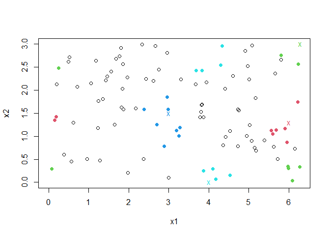

<!-- README.md is generated from README.Rmd. Please edit that file -->

# donut

[](https://ci.appveyor.com/project/paulnorthrop/donut)
[](https://codecov.io/github/paulnorthrop/donut?branch=master)
[](https://cran.r-project.org/package=donut)

## Nearest Neighbour Search with Variables on a Torus

### What does donut do?

There are several R packages, such as
[RANN](https://cran.r-project.org/package=RANN) and
[nabor](https://cran.r-project.org/package=nabor) that find the *k*
nearest neighbours in a dataset of specified query points, based on some
metric, such as L2 or L1. The donut package considers the situation
where one or more of the variables in the dataset is periodic on a
finite interval. For example, direction is periodic on the interval
(0,360) degrees. In the small dataset {10, 90, 350} degrees 350 is
closer to 10 than is 90: 10 and 350 are separated by 20 degrees, 10 and
90 by 80 degrees.

The function `nnt()` finds the *k* nearest neighbours of each of a set
of points of interest, wrapping periodic variables on a torus so that
this periodicity is reflected. The user chooses the function to use to
find the nearest neighbours. The nearest neighbour functions from the
aforementioned packages are used as examples.

### An example

We use a simple example from the `RANN:nn2()` documentation. We suppose
that both variables should be wrapped, on the ranges (0,2*π*) and (0,3)
respectively. We choose the query points of interest to illustrate the
wrapping of the variables. In the plot, query points are indicated with
colour-coded crosses and the 8 nearest neighbours of each point are
shaded in the same colour. By default `nnt()` uses the function
`RANN::nn2()` (based on the L2 metric) to find the nearest neighbours.

``` r
library(donut)
set.seed(20092019)
x1 <- runif(100, 0, 2 * pi)
x2 <- runif(100, 0, 3)
DATA <- data.frame(x1, x2)
ranges <- rbind(c(0, 2 * pi), c(0, 3))
query <- rbind(c(6, 1.3), c(2 * pi, 3), c(3, 1.5), c(4, 0))
library(RANN)
res2 <- nnt(DATA, query, k = 8, torus = 1:2, ranges = ranges)
plot(res2)
```

<!-- -->

### Installation

To get the current released version from CRAN:

``` r
install.packages("donut")
```

### Vignette

See `vignette("donut-vignette", package = "donut")` for an overview of
the package.
